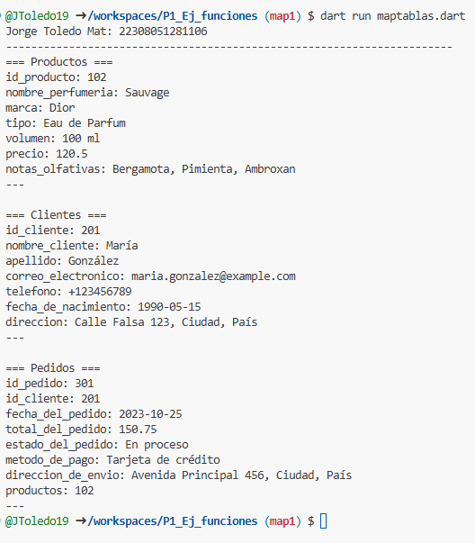

ejercicio map tablas

crear map <string,dynamic> producto con los siguientes key, id producto,nombre_perfumeria, marca, tipo, volumen,precio,notas olfativas. y mostrar los datos con un forech. lenguaje dart, es una perfumeria

crear map <string,dynamic> cliente con los siguientes key, id cliente,nombre_cliente, apellido, correo electronico, telefono,fecha de nacimiento,direccion. y mostrar los datos con un forech. lenguaje dart, es una perfumeria

crear map <string,dynamic> pedido con los siguientes key, id pedido, id cliente , fecha del pedido, total del pedido ,estado del pedido ,metodo de pago,direccion de envio . y mostrar los datos con un forech. lenguaje dart, es una perfumeria

imprecion de datos
