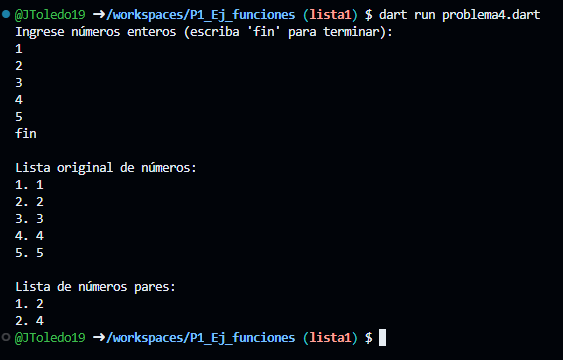

Escribe un programa que tome una lista de números enteros (int) y devuelva una nueva lista con solo los números pares, que utilice 2 funciones una para capturar datos de la lista y otra para mostrar los elementos
Resolver un ejercicio de acuerdo a la asignación del problema

